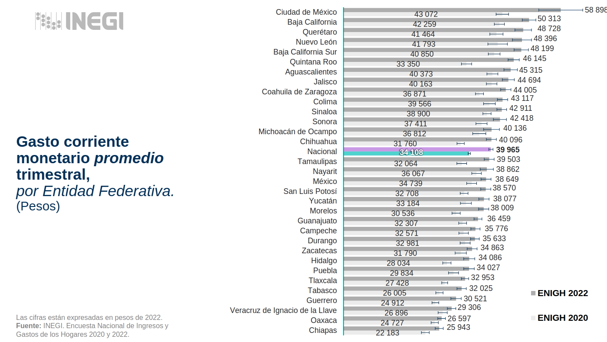
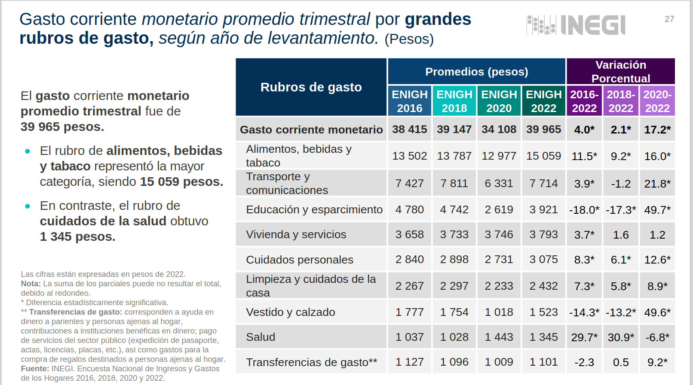

## Cómo usar la ENIGH como cañidios

### 1. Baja su pack
```{r}
devtools::install_github("Villiem/importinegi",
                        ref="master")
```
### 2. Usa la función ENIGH y baja la que quieras
Aquí usaré de ejemplo la 2022 y solo el concentradohogar.
```{r}
enigh <- importinegi::enigh(year = 2022, 'concentradohogar', formato = "sav")
```
```{r}
kableExtra::kable(head(enigh[1:4]))
```

En teoría antes de este paso, lo ideal sería pegar las bases de datos que necesitemos, además de seleccionar las columnas que usaremos, renglones que filtraremos o crear nuevas variables. Cuando hice mi trabajo de Eva usaba algo así para la ENOE antes de meterla como un muestreo complejo. Acá solo haré una columna extra de Estado.

```{r, eval=F}

### Esto es un ejemplo de como filtré la ENOE con Eva
enoe1 <- enoe |> 
  filter(
    clase1 == 1,
    clase2 == 1, 
    between(eda, 15,64), 
    ing_x_hrs > 0, 
    ambito1 != 1, 
    pos_ocu %in% c(1,3),
    mh_col %in% c(1,2,7,8)
    #remune2c == 1
    ) |> 
  mutate(log2_ing_x_hrs = log2(ing_x_hrs))

```

```{r, warning=FALSE,message=FALSE}
library(tidyverse)
library(srvyr)
library(sjlabelled)
options(survey.lonely.psu="adjust")
```
```{r}
enigh <- enigh |> 
  mutate(edo = substr(ubica_geo,1,2)) # Nomas crea el Estado
```

Vamos a hacer esta gráfica.


Recreando la gráfica.

### Paso 1. Hacerlo muestreo complejo


```{r}
strata <- enigh|> 
  as_survey_design(
  id=upm, 
  strata = est_dis,
  weights = factor)
```

### Paso 2. agrupas y sacas la media
```{r}
df <- strata |> 
  srvyr::group_by(edo) |> 
  srvyr::summarise(promedio_ingreso = survey_mean(ing_cor))
kableExtra::kable(head(df))
```


### Paso 3. Le preguntas a chat como hacer la gráfica bonita
```{r, out.width="70%", fig.cap="Ejemplo 1" }
# Crear el mapeo de códigos a nombres completos de estados
codigo_a_nombre <- c(
  "01" = "Aguascalientes", "02" = "Baja California", "03" = "Baja California Sur",
  "04" = "Campeche", "05" = "Coahuila de Zaragoza", "06" = "Colima", "07" = "Chiapas",
  "08" = "Chihuahua", "09" = "Ciudad de México", "10" = "Durango",
  "11" = "Guanajuato", "12" = "Guerrero", "13" = "Hidalgo", "14" = "Jalisco",
  "15" = "Estado de México", "16" = "Michoacán de Ocampo", "17" = "Morelos", "18" = "Nayarit",
  "19" = "Nuevo León", "20" = "Oaxaca", "21" = "Puebla", "22" = "Querétaro",
  "23" = "Quintana Roo", "24" = "San Luis Potosí", "25" = "Sinaloa", "26" = "Sonora",
  "27" = "Tabasco", "28" = "Tamaulipas", "29" = "Tlaxcala", "30" = "Veracruz de Ignacio de la Llave",
  "31" = "Yucatán", "32" = "Zacatecas"
)

# Asumiendo que tu dataframe se llama df y tiene el formato mencionado
# Agregar la columna con los nombres de los estados
df <- df %>%
  mutate(nombre_estado = codigo_a_nombre[edo])

# Ordenar de mayor a menor por promedio_ingreso
df_ordenado <- df %>%
  arrange(desc(promedio_ingreso))

# Crear la gráfica de barras horizontales con barras de error
ggplot(df_ordenado, aes(x = reorder(nombre_estado, promedio_ingreso), y = promedio_ingreso)) +
  geom_bar(stat = "identity", fill = "gray", width = 0.7) +
  geom_errorbar(aes(ymin = promedio_ingreso - promedio_ingreso_se, 
                    ymax = promedio_ingreso + promedio_ingreso_se),
                width = 0.2) +
  geom_text(aes(label = format(round(promedio_ingreso), big.mark = " ")), 
            hjust = -0.3, size = 3) +
  coord_flip() +
  labs(
    title = "Gasto corriente monetario promedio trimestral,",
    subtitle = "por Entidad Federativa\n(Pesos)",
    x = "",
    y = ""
  ) +
  theme_minimal() +
  theme(
    panel.grid.major.y = element_blank(),
    panel.grid.minor.y = element_blank(),
    axis.text.y = element_text(face = "bold"),
    plot.title = element_text(face = "bold", size = 14),
    plot.subtitle = element_text(face = "bold", size = 14)
  ) +
  scale_y_continuous(limits = c(0, max(df$promedio_ingreso + df$promedio_ingreso_se) * 1.1),
                     labels = scales::comma)

```

Y ya le vas moviendo a lo que necesites.

### Ejemplo 2



###